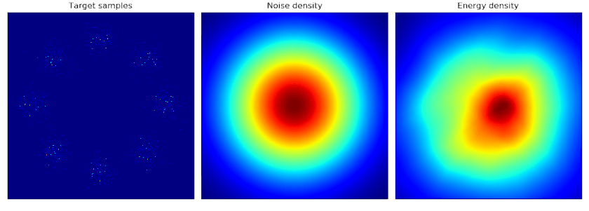
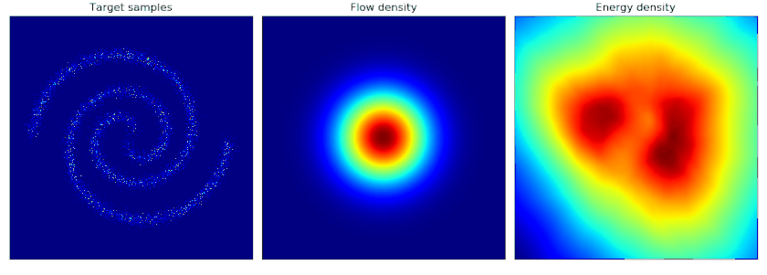

# Noise Contrastive Estimation (NCE)

### Introduction

This is an implementation of  [Noise Contrastive Estimation (NCE)]( http://proceedings.mlr.press/v9/gutmann10a/gutmann10a.pdf ) in PyTorch on 2D dataset. 

NCE is a method to estimate energy based models (EBM)

$$p_\theta(x) = \frac{\exp[-f_\theta(x)]}{Z(\theta)}$$

where

$$Z(\theta) = \int\exp[-f_\theta(x)]dx$$

is the normalizing constant that is hard to compute. In NCE,  the normalizing constant is treated as a trainable parameter $c=\log Z$. We cannot directly do maximum likelihood estimation (MLE) with $\displaystyle\max_\theta p_\theta(x)$ because $p_\theta(x)$ can simply blow up to infinity by letting  $Z\to0$ (or $c\to -\infty$). Instead, in Noise Contrastive Estimation, we train the energy based model by doing (nonlinear) logistic regression/classification between the data distribution $p_{\mathrm{data}}$ and some noise distribution $q$. 

There are three requirements for the noise distribution $q$:

&nbsp;&nbsp;(1) log density can be evaluated on any input;

&nbsp;&nbsp;(2) samples can be obtained from the distribution;

&nbsp;&nbsp;(3) $q(x)\neq0$ for all $x$ such that $p\_{\mathrm{data}}(x)\neq0$.

Here we use Multivariate Gaussian as the noise distribution. 

The objective is to _maximize_ the posterior log-likelihood of the classification

$$V(\theta) = \mathbb{E}\_{x\sim p\_{\text{data}}}\log\frac{p\_\theta(x)}{p\_\theta(x)+q(x)} + \mathbb{E}\_{\tilde{x}\sim q}\log\frac{q(\tilde{x})}{p\_\theta(\tilde{x}) + q(\tilde{x})}.$$

This objective is implemented in the file [util.py](util.py) as the `value` function (we minimize $-V(\theta)$). We use Adam as the optimizer.

### Installation

Clone the repository to your local machine with

```shell
git clone https://github.com/lifeitech/nce.git
```

In your python environment, `cd` to the repository, and 

```shell
pip install -r requirements.txt
```

### Training

To train the model, do

```shell
python trian.py
```

For MacOS users, since currently PyTorch only has limited support for `mps`, make sure to run the script with `PYTORCH_ENABLE_MPS_FALLBACK=1`. You can add

```shell
export PYTORCH_ENABLE_MPS_FALLBACK=1 
```

to your `.zshrc` file.

Available datasets:

- `8gaussians` (default)
- `2spirals`
- `checkerboard`
- `rings`
- `pinwheel`

A density plot is saved in the folder `images` after every epoch. After training, you can obtain gif images like below by executing the python script in the folder:

```shell
cd images
python create_gif.py
```


### Examples

Some visualizations of the learned energy densities are listed below.

- `8gaussians` dataset



- `pinwheel` dataset


- `2spirals` dataset

